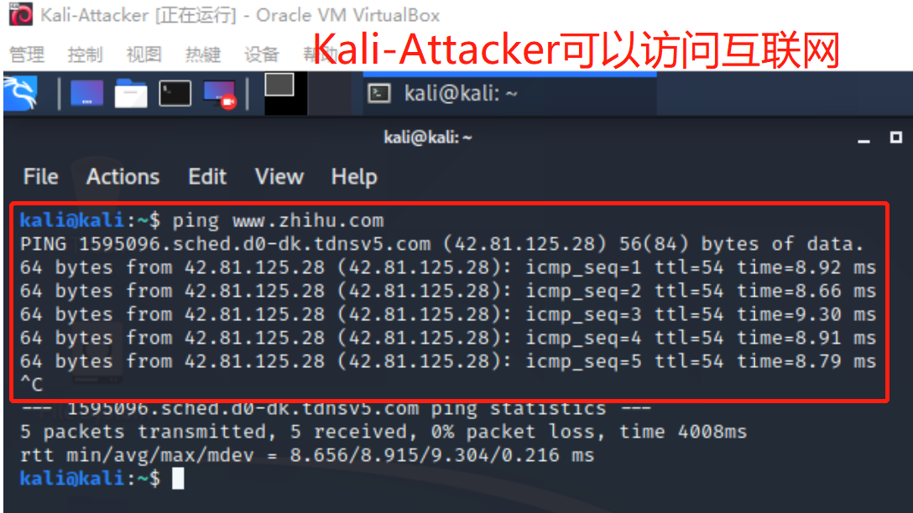

## 基于 VirtualBox 的网络攻防基础环境搭建

### 实验目的
- 掌握 VirtualBox 虚拟机的安装与使用；
- 掌握 VirtualBox 的虚拟网络类型和按需配置；
- 掌握 VirtualBox 的虚拟硬盘多重加载；
### 实验环境

- VirtualBox 6.1.4
- 攻击者主机（Attacker）：Kali Rolling 2020.3 x64
- 网关（Gateway, GW）：Debian 4.19.0-10-amd64
- 靶机（Victim）：
  - Kali Rolling 2020.3 x64 
  - Debian 4.19.0-10-amd64 
  - Windows XP Professional with Service Pack 3 (x86) - CD VL (Chinese-Simplified)

### 实验要求

完成以下网络连通性测试；
- [x] 靶机可以直接访问攻击者主机
- [x] 攻击者主机无法直接访问靶机
- [x] 网关可以直接访问攻击者主机和靶机
- [x] 靶机的所有对外上下行流量必须经过网关
- [x] 所有节点均可以访问互联网


### 实验步骤

1. 虚拟机实现多重加载。

    具体操作和上学期的步骤一样，在虚拟介质管理器里面选中盘片之后选择多重加载，再新建的时候直接使用多重加载的镜像文件就好了。

    

2. 各个虚拟机的安装。
   
- kali我用的是官网的ova文件，不需要配置，但是需要将USB2.0切换至USB1.1，否则VirtualBox会报错。
- debian的安装遵照黄大群里发的[链接](https://phoenixnap.com/kb/how-to-install-debian-10-buster)，并安装 OpenSSH Server 和 standard system utilities。注意设置 GRUB 安装位置为 /dev/sda.
- XP基本无脑配置，配置完之后在控制面板里关掉防火墙。

    

3. 按照以下拓扑图进行网络配置。

- 网关（Debian-Gateway）的配置
  - 配置四块网卡分别为"NAT网络"“Host Only”“内部网络（intnet1）”和“内部网络（intnet2）”。
  
  - 这个时候我们观察可以发现，除了第一块网卡之外，其余的网卡都没有分配地址。
  
  - 首先进行第二块网卡Host-Only地址的分配，对应enp0s8。
    ```bash
    allow-hotplug enp0s8
    iface enp0s8 inet dhcp
    ```
    
  - 确认ssh服务开启后，通过VScode远程连接到虚拟机。~~就可以愉快地复制粘贴了。~~
  - 按照[黄大发的gist](https://gist.github.com/c4pr1c3/8d1a4550aa550fabcbfb50fad9718db1)更改`/etc/network/interfaces`配置。之后重启服务并开启所有Down状态的网卡。配置完成后如下图所示。
    ```bash
    systemctl restart networking
    /sbin/ifup enp0s8 # etc
    ```
    
  - 安装dnsmasq服务器并进行相关的配置，[链接同上](https://gist.github.com/c4pr1c3/8d1a4550aa550fabcbfb50fad9718db1)。
    ```bash
    apt install dnsmasq
    cp /etc/dnsmasq.conf /etc/dnsmasq.conf.bak
    # 更改 /etc/dnsmasq.conf 等相关配置
    systemctl restart dnsmasq
    ```
    
- 配置靶机
  - XP靶机需要将网络改为拓扑图对应的内部网络，将控制芯片改成`Intel Pro/1000T 服务器`。
  
  - Debian和Kali靶机只需要将网络改为拓扑图对应的内部网络。
- 查看当前ip:


<center>
<figure>


</figure>
</center>

- 此时，整理出各个虚拟机对应的IP地址如下：
  
| 虚拟机名称      | IP地址                                |
| --------------- | ------------------------------------- |
| Kali-Attacker   | 10.0.2.5/24（NATNetwork）             |
| Kali-Victim     | 172.16.111.132/24（内部网络 intnet1） |
| XP-Victim-1     | 172.16.111.110/24（内部网络 intnet1） |
| XP-Victim-2     | 172.16.222.141/24（内部网络 intnet2） |
| Debian-Victim-2 | 172.16.222.117/24（内部网络 intnet2） |
| Debian-Gateway  | 10.0.2.15/24 （NATNetwork）           |
|                 | 192.168.56.101/24 （Host Only）       |
|                 | 172.16.111.1/24（内部网络 intnet1）   |
|                 | 172.16.222.1/24（内部网络 intnet2）   |


### 网络连通性测试

- [x] 靶机可以直接访问攻击者主机

<center>
<figure>


</figure>
</center>

- [x] 攻击者主机无法直接访问靶机

  

- [x] 网关可以直接访问攻击者主机和靶机

  
- [x] 靶机的所有对外上下行流量必须经过网关
- [x] 所有节点均可以访问互联网

  
  在网关上安装`tcpdump`，并对对应网卡进行监控。在各个节点上访问互联网，观察捕获到了上下行的包。关闭网关，发现所有节点都无法访问互联网，说明靶机的所有对外上下行流量必须经过网关。

  ```bash
  apt insatll tcpdump
  /usr/sbin/tcpdump -i enp0s8 # etc
  ```

  

  

  

  

  

### 参考

- [黄大的Debian安装链接](https://phoenixnap.com/kb/how-to-install-debian-10-buster)
- [黄大的gist]((https://gist.github.com/c4pr1c3/8d1a4550aa550fabcbfb50fad9718db1))
- [揭青莹师姐的作业](https://github.com/CUCCS/2019-NS-Public-YanhuiJessica/tree/ns0x01/ns-0x01)


