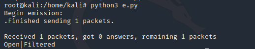
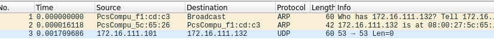

- [实验五：基于 Scapy 编写端口扫描器](#实验五基于-scapy-编写端口扫描器)
  - [实验目的](#实验目的)
  - [实验环境](#实验环境)
  - [实验要求(完成度)](#实验要求完成度)
  - [Scapy 基础](#scapy-基础)
  - [实验原理](#实验原理)
  - [实验过程](#实验过程)
    - [网络拓扑](#网络拓扑)
    - [端口状态模拟](#端口状态模拟)
    - [TCP connect scan](#tcp-connect-scan)
    - [TCP stealth scan](#tcp-stealth-scan)
    - [TCP Xmas scan](#tcp-xmas-scan)
    - [TCP fin scan](#tcp-fin-scan)
    - [TCP null scan](#tcp-null-scan)
    - [UDP scan](#udp-scan)
    - [其他实验问题的回答](#其他实验问题的回答)
  - [参考](#参考)

##  实验五：基于 Scapy 编写端口扫描器

### 实验目的

- 掌握网络扫描之端口状态探测的基本原理

### 实验环境

- python3 + [scapy](https://scapy.net/)2.4

### 实验要求(完成度)

- [x] TCP connect scan / TCP stealth scan
- [x] TCP Xmas scan / TCP fin scan / TCP null scan
- [x] UDP scan
- [x] 上述每种扫描技术的实现测试均需要测试端口状态为：`开放`、`关闭` 和 `过滤` 状态时的程序执行结果
- [x] 提供每一次扫描测试的抓包结果并分析与课本中的扫描方法原理是否相符？如果不同，试分析原因；
- [x] 在实验报告中详细说明实验网络环境拓扑、被测试 IP 的端口状态是如何模拟的
- [x] （可选）复刻 `nmap` 的上述扫描技术实现的命令行参数开关（每种扫描测试一种状态，且后面专门用nmap进行了扫描实验）

### Scapy 基础

```python
# 导入模块
from scapy.all import *
# 查看包信息
pkt = IP(dst="")
ls(pkt)
pkt.show()
summary(pkt)
# 发送数据包
send(pkt)  # 发送第三层数据包，但不会受到返回的结果。
sr(pkt)  # 发送第三层数据包，返回两个结果，分别是接收到响应的数据包和未收到响应的数据包。
sr1(pkt)  # 发送第三层数据包，仅仅返回接收到响应的数据包。
sendp(pkt)  # 发送第二层数据包。
srp(pkt)  # 发送第二层数据包，并等待响应。
srp1(pkt)  # 发送第二层数据包，并返回响应的数据包
# 监听网卡
sniff(iface="wlan1",count=100,filter="tcp")
# 应用：简单的SYN端口扫描 （测试中）
pkt = IP("...")/TCP(dport=[n for n in range(22, 3389)], flags="S")
ans, uans = sr(pkt)
ans.summary() # flag为SA表示开放，RA表示关闭
```
### 实验原理

详细的说明在黄大[课本](https://c4pr1c3.gitee.io/cuc-ns/chap0x05/main.html)里。

> `TCP connect scan` 与 `TCP stealth scan` 都是先发送一个`S`，然后等待回应。如果有回应且标识为`RA`，说明目标端口处于关闭状态；如果有回应且标识为`SA`，说明目标端口处于开放状态。这时
> - `TCP connect scan`会回复一个RA，在完成三次握手的同时断开连接
> - `TCP stealth scan`只回复一个R，不完成三次握手，直接取消建立连接
> 
>
> `TCP Xmas scan、TCP fin scan`及`TCP null scan`不涉及三次交互。它们都是先发送一个包，然后根据目标主机是否回复`R`来目标端口的状态。不同的是：
> - TCP Xmas scan发送的是`FPU`
> - TCP fin scan发送的是`F`
> - TCP null scan发送的包里没有设置任何flag
>
> UDP是无连接的协议，通过发送`UDP+port`得到的回复确定被扫描主机的状态。
> 
> - Open：`no response / server responds to the client with a UDP packet`；
> - Closed：`ICMP error type 3 and code 3`
> - filtered：`no response / ICMP error type 3 and code 1,2,3,9,10,13`。

### 实验过程

#### 网络拓扑


使用类似第四节实验的拓扑结构，Attacker作为扫描端，Victim作为被扫描的靶机。

#### 端口状态模拟

- **关闭状态**：对应端口没有开启监听, 防火墙没有开启。
  ```bash
  ufw disable
  ```
- **开启状态**：对应端口开启监听: apache2基于TCP, 在80端口提供服务; DNS服务基于UDP,在53端口提供服务。防火墙处于关闭状态。
  ```bash
  systemctl start apache2 # port 80
  systemctl start dnsmasq # port 53
  ```
- **过滤状态**：对应端口开启监听, 防火墙开启。
  ```bash
  ufw enable && ufw deny 80/tcp
  ufw enable && ufw deny 53/udp
  ```


初始状态：


#### TCP connect scan
- Closed
  
  
  
  

- Open

  
  
  

- Filtered
  
  
  
  


#### TCP stealth scan

- Closed
  
  
  
  

- Open

  
  
  

- Filtered
  
  
  
  

#### TCP Xmas scan

- Closed
  
  
  
  

- Open

  
  
  

- Filtered
  
  
  
  

#### TCP fin scan

- Closed
  
  
  
  

- Open

  
  
  

- Filtered
  
  
  
  

#### TCP null scan

- Closed
  
  
  
  

- Open

  
  
  

- Filtered
  
  
  
  


#### UDP scan

- Closed
  
  
  
  

- Open

  
  
  

- Filtered
  
  
  
  

#### 其他实验问题的回答

> 提供每一次扫描测试的抓包结果并分析与课本中的扫描方法原理是否相符？如果不同，试分析原因；

[抓包结果]()

基本相符。


### 参考

- [scapy2.4.4文档](https://scapy.readthedocs.io/en/latest/)
- [Port Scanning Using Scapy](https://resources.infosecinstitute.com/port-scanning-using-scapy/)
- [揭青莹师姐的作业](https://github.com/CUCCS/2019-NS-Public-YanhuiJessica/blob/ns0x05/ns-0x05/README.md)