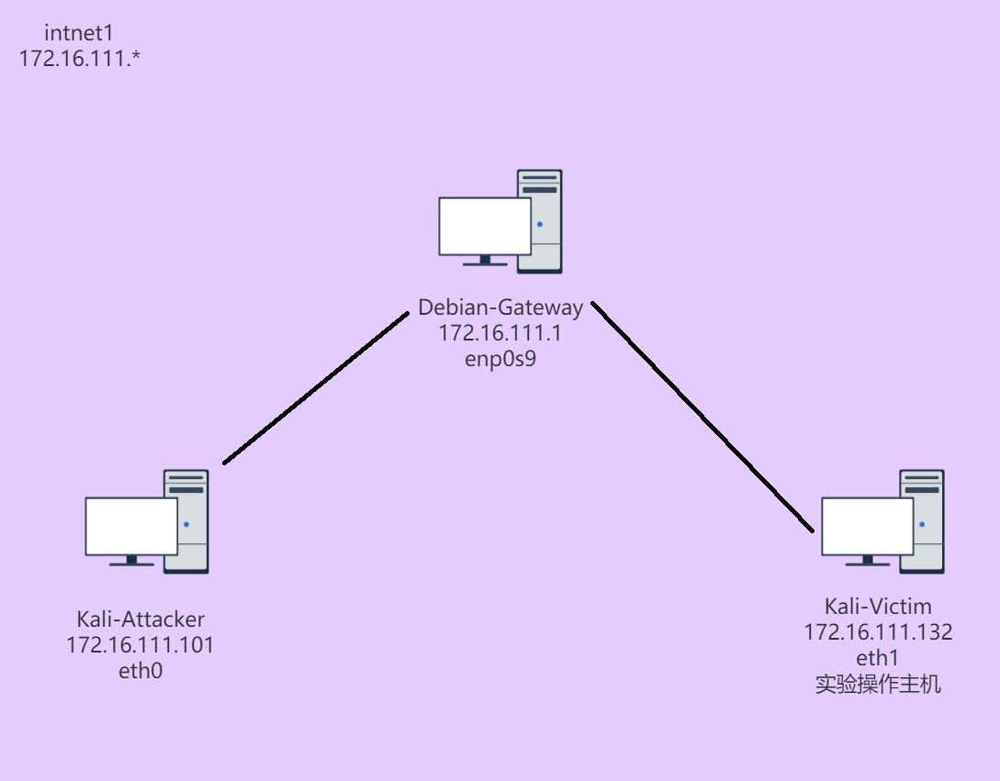
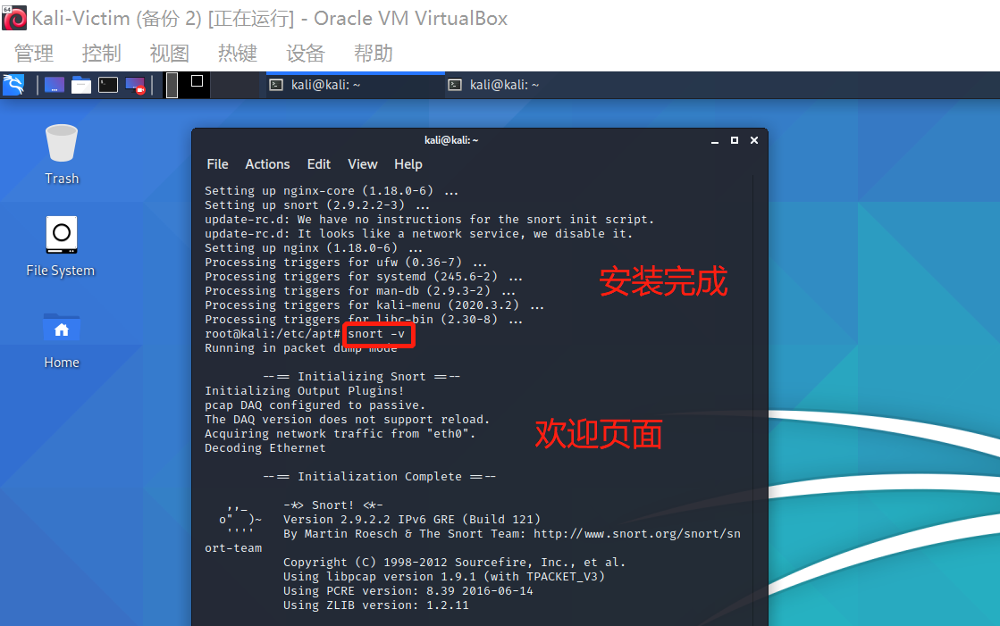
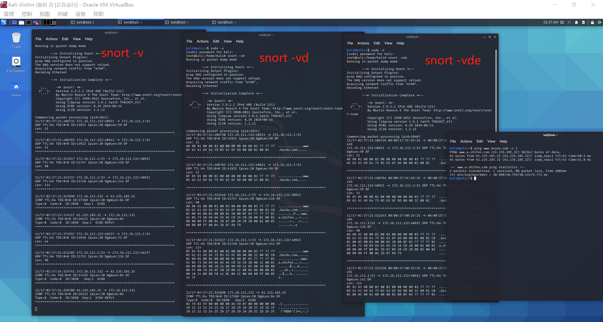
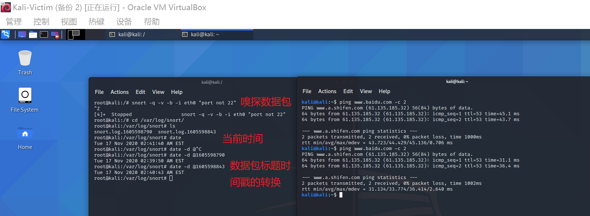
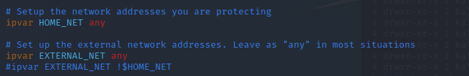
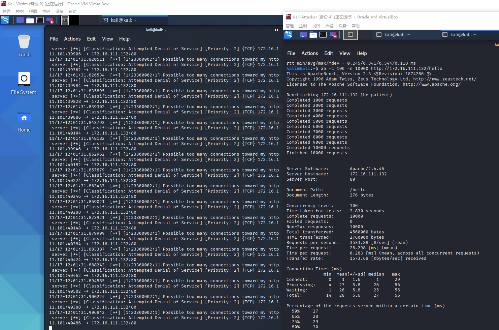
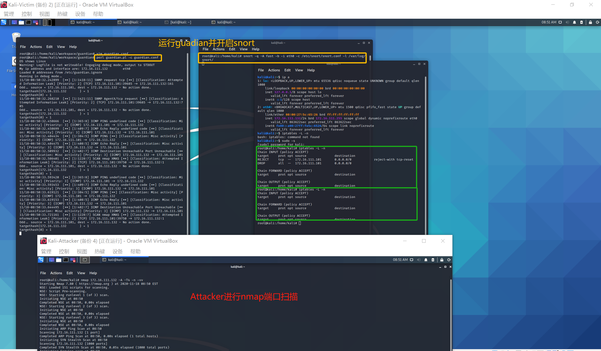

# 实验九 入侵检测

## 环境配置
### 拓扑结构

### Snort安装

```bash
# 禁止在apt安装时弹出交互式配置界面
export DEBIAN_FRONTEND=noninteractive

apt install snort
```

## 实验流程

### 实验一：配置snort为嗅探模式

```bash
# 显示IP/TCP/UDP/ICMP头
snort –v
# 显示应用层数据
snort -vd

# 显示数据链路层报文头
snort -vde

# -b 参数表示报文存储格式为 tcpdump 格式文件
# -q 静默操作，不显示版本欢迎信息和初始化信息
snort -q -v -b -i eth1 "port not 22"
```


```bash
# 使用 CTRL-C 退出嗅探模式
# 嗅探到的数据包会保存在 /var/log/snort/snort.log.<epoch timestamp>
# 其中<epoch timestamp>为抓包开始时间的UNIX Epoch Time格式串
# 可以通过命令 date -d @<epoch timestamp> 转换时间为人类可读格式
# exampel: date -d @1511870195 转换时间为人类可读格式
# 上述命令用tshark等价实现如下：
tshark -i eth1 -f "port not 22" -w 1_tshark.pcap
```


抓到的包在这里。[1_tshark.pcap](file/1_tshark.pcap),
[snort.log.1605598843](file/snort.log.1605598843)

### 实验二：配置并启用snort内置规则

```bash
# /etc/snort/snort.conf 中的 HOME_NET 和 EXTERNAL_NET 需要正确定义
# 例如，学习实验目的，可以将上述两个变量值均设置为 any
snort -q -A console -b -i eth1 -c /etc/snort/snort.conf -l /var/log/snort/
```



### 实验三：自定义snort规则

```bash
# 注：这里用课件的代码会导致实际传入的变量为空（不是已经转义了么），因此使用vim
# 新建自定义 snort 规则文件
vim /etc/snort/rules/cnss.rules

# INSERT
alert tcp $EXTERNAL_NET any -> $HTTP_SERVERS 80 (msg:"Access Violation has been detected on /etc/passwd ";flags: A+; content:"/etc/passwd"; nocase;sid:1000001; rev:1;)
alert tcp $EXTERNAL_NET any -> $HTTP_SERVERS 80 (msg:"Possible too many connections toward my http server"; threshold:type threshold, track by_src, count 100, seconds 2; classtype:attempted-dos; sid:1000002; rev:1;)

# 添加配置代码到 /etc/snort/snort.conf
include $RULE_PATH/cnss.rules

# 开启apache2
service apache2 start
# 应用规则开启嗅探
snort -q -A fast -b -i eth1 -c /etc/snort/snort.conf -l /var/log/snort/

# 在attacker上使用ab命令进行压力测试
ab -c 100 -n 10000 http://$dst_ip/hello
```





### 实验四：和防火墙联动 
本实验需要用到的脚本代码 [Guardian-1.7.tar.gz](attach/guardian.tar.gz) ，请下载后解压缩：

```bash
# 解压缩 Guardian-1.7.tar.gz
tar zxf guardian.tar.gz

# 安装 Guardian 的依赖 lib
apt install libperl4-corelibs-perl
```

在Victim上先后开启 ``snort`` 和 ``guardian.pl``

```bash
# 开启 snort
snort -q -A fast -b -i eth1 -c /etc/snort/snort.conf -l /var/log/snort/
```

```bash
# 假设 guardian.tar.gz 解压缩后文件均在 /root/guardian 下
cd /root/guardian
```

编辑 guardian.conf 并保存，更改参数为

```ini
HostIpAddr      172.16.111.132
Interface       eth1
```

```bash
# 启动 guardian.pl
perl guardian.pl -c guardian.conf
```

在Attack上用 ``nmap`` 暴力扫描 Victim：

```bash
nmap 172.16.111.132 -A -T4 -n -vv
```

guardian.conf 中默认的来源IP被屏蔽时间是 60 秒（屏蔽期间如果黑名单上的来源IP再次触发snort报警消息，则屏蔽时间会继续累加60秒）

（以下为课件中示例的显示）
```bash
root@KaliRolling:~/guardian# iptables -L -n
Chain INPUT (policy ACCEPT)
target     prot opt source               destination
REJECT     tcp  --  192.168.56.101       0.0.0.0/0            reject-with tcp-reset
DROP       all  --  192.168.56.101       0.0.0.0/0

Chain FORWARD (policy ACCEPT)
target     prot opt source               destination

Chain OUTPUT (policy ACCEPT)
target     prot opt source               destination


# 1分钟后，guardian.pl 会删除刚才添加的2条 iptables 规则
root@KaliRolling:~/guardian# iptables -L -n
Chain INPUT (policy ACCEPT)
target     prot opt source               destination

Chain FORWARD (policy ACCEPT)
target     prot opt source               destination

Chain OUTPUT (policy ACCEPT)
target     prot opt source               destination
```

（以下是实验的显示）


## 实验思考题

1. IDS与防火墙的联动防御方式相比IPS方式防御存在哪些缺陷？是否存在相比较而言的优势？

  IDS通过软、硬件，对网络、系统的运行状况进行监视，尽可能发现各种攻击企图、攻击行为或者攻击结果，以保证网络系统资源的机密性、完整性和可用性。

  IPS是一部能够监视网络或网络设备的网络资料传输行为的计算机网络安全设备，能够即时的中断、调整或隔离一些不正常或是具有伤害性的网络资料传输行为。

  也就是说，IDS偏向于检测，属于管理系统，会检测出不安全的网络行为，但是不阻断任何网络行为。IPS偏向于防御，属于控制系统，可以阻止危险行为。

  举个形象的例子，防火墙可以比作一栋楼的门锁，IDS就是警告系统，可以在有人撬锁后嗅探到，IPS则会在嗅探到有人撬锁后把门冻结。

2. 使用 Suricata 代替 Snort ， 重复本实验。

  未完成。 

3. 配置 Suricata 为 IPS 模式，重复 ``实验四`` 。

  未完成。

## 问题

- "Unable to locate snort."
  
  将如下内容添加到 sources.list 文件末尾
  ```bash
    deb http://http.kali.org/kali kali-rolling main contrib non-free
    # For source package access, uncomment the following line
    # deb-src http://http.kali.org/kali kali-rolling main contrib non-free
    deb http://http.kali.org/kali sana main non-free contrib
    deb http://security.kali.org/kali-security sana/updates main contrib non-free
    # For source package access, uncomment the following line
    # deb-src http://http.kali.org/kali sana main non-free contrib
    # deb-src http://security.kali.org/kali-security sana/updates main contrib non-free
    deb http://old.kali.org/kali moto main non-free contrib
    # For source package access, uncomment the following line
    # deb-src http://old.kali.org/kali moto main non-free contrib

  ```

## 参考
- [谌雯馨师姐的作业](https://github.com/CUCCS/2019-NS-Public-chencwx/blob/ns_chap0x09/ns_chapter9/%E5%85%A5%E4%BE%B5%E6%A3%80%E6%B5%8B.md)
- [Snort installation in Kali Linux from the source](https://koayyongcett.medium.com/snort-installation-in-kali-linux-from-the-source-9a005558a2ea)
- [snort的安装、配置和使用](https://blog.csdn.net/qq_37865996/article/details/85088090)

