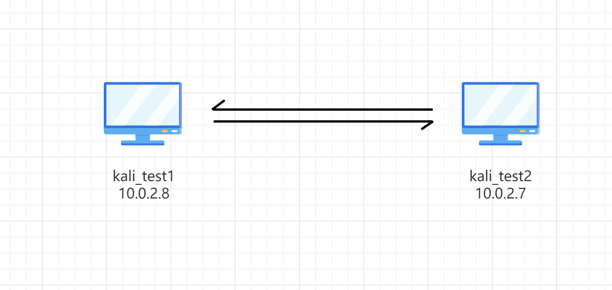
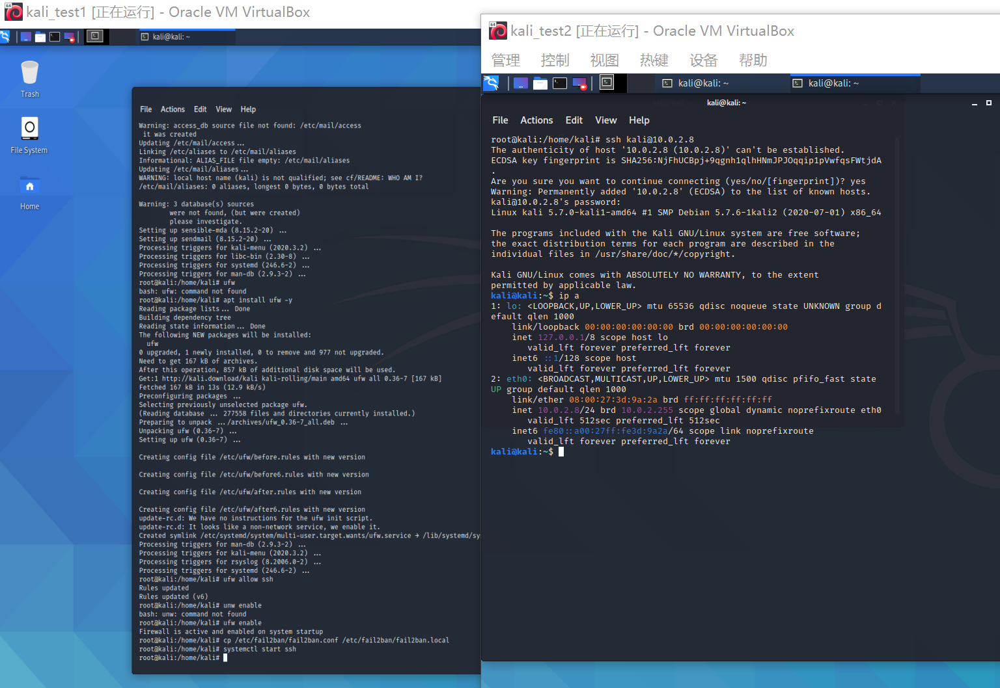
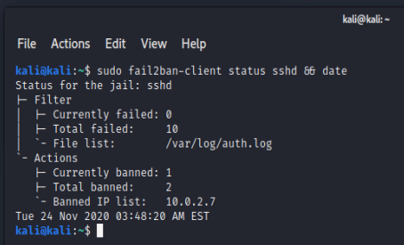
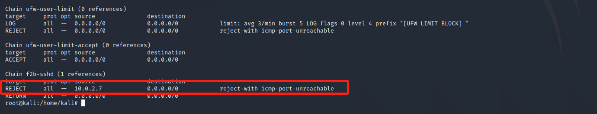
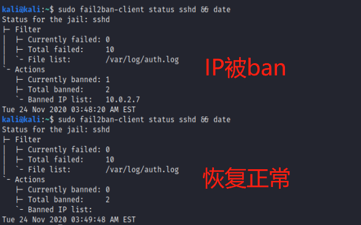
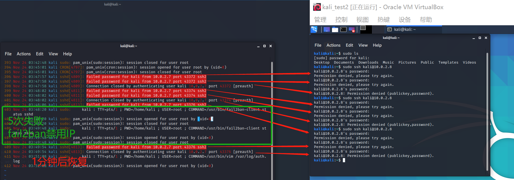

## 实验十 应用程序安全加固
### 实验环境
- 虚拟机：Kali Rolling 2020.3 x64
- Fail2Ban 0.11.1
### 实验目的
使用Fail2Ban练习安全加固。
### 实验流程
#### 拓扑

两台主机可以相互联通。
#### Fail2Ban 安装
黄大提供的这个[文档](https://www.linode.com/docs/guides/using-fail2ban-to-secure-your-server-a-tutorial/)上给了非常详尽的操作，安装顺利得可怕。
#### 配置
根据需求修改`/etc/fail2ban/jail.local`。
```bash
# 禁用时间修改为1min
bantime = 1m
# 最大尝试次数为5次
maxretry = 5
```

#### 操作
- 在kali_test1(10.0.2.8)上开启ssh，kali_test2(10.0.2.7)上连接。输入正确的密码，说明是可以通过ssh正常远程登录的。
  

- 在test2上输入错误密码，重复多次。发现连接没有反应。
  这时可以查看test1上的sshd状态和防火墙状态。可以推测出fail2ban的原理应用到了之前学的防火墙规则。

  
  
    

- 等待1分钟后，恢复正常。
  
    

- 查看`auth.log`。可以看出，在test2上每第三次输入错误密码会导致直接导致连接中断，这次操作没有被计算到会被禁的5次操作里面。等待1分钟后，原先的登录请求仍会被执行。
  
  

（这次实验报告好短啊 :P

### 参考
- [Using Fail2ban to Secure Your Server - A Tutorial](https://www.linode.com/docs/guides/using-fail2ban-to-secure-your-server-a-tutorial/)


### 思考题
**试举一例说明“人的安全意识和安全能力在应用程序安全加固中是不可忽视的重要环节”。**

将写有口令的便利贴贴在电脑屏幕或者工作台上。这种行为虽然攻击者无法用技术手段检测到，但是在物理世界中是极其不安全的。《硅谷》中有一个事件就是因为主人公顺手拿到了管理人员便利贴上写的口令从而“黑”进了另一个公司系统，安全工程师却一直找不到服务器的漏洞或者被攻击的记录）。没有安全意识和安全能力，再完美的防护体系也是徒劳。