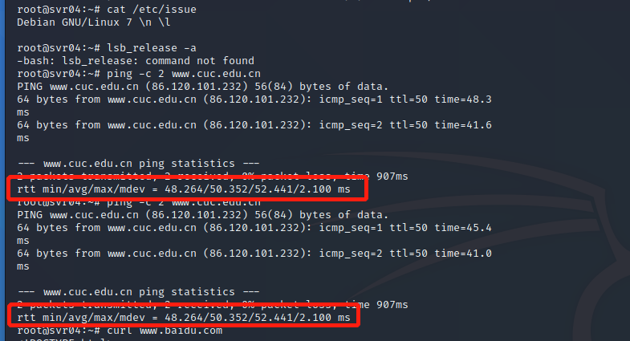
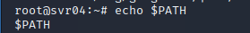

# 常见蜜罐体验和探索

## 实验目的

- 了解蜜罐的分类和基本原理
- 了解不同类型蜜罐的适用场合
- 掌握常见蜜罐的搭建和使用

## 实验环境


## 实验要求

- [x] 记录蜜罐的详细搭建过程；
- [x] 使用`nmap`扫描搭建好的蜜罐并分析扫描结果，同时分析「 nmap 扫描期间」蜜罐上记录得到的信息；
- [x] 如何辨别当前目标是一个「蜜罐」？以自己搭建的蜜罐为例进行说明；
- [ ] （可选）总结常见的蜜罐识别和检测方法；
- [ ] （可选）基于 canarytokens 搭建蜜信实验环境进行自由探索型实验

## 实验过程

### 低交互蜜罐 Twisted Honeypots
- Why twisted-honeypots?

    总的来说，因为简单。

    该蜜罐GitHub仓库主页上提供了安装说明，操作极其简单，界面也比较友好。同时也满足了实验需求。

    （在仓库的贡献者里面还发现了揭师姐，师姐太强了！jdltxdy！）

    界面长这样。

    

    

- 需要预先配置的环境

    pip3 之前安装过，不作赘述。

    > SSH, FTP and Telnet honeypot services based on the [Twisted](http://twistedmatrix.com/) engine for Python 3.

    Kali默认使用Python2，所以需要改成Python3.

    ```bash
    # 调整优先级
    update-alternatives --install /usr/bin/python python /usr/bin/python2 1
    update-alternatives --install /usr/bin/python python /usr/bin/python3 2
    ```


- Install

    ```bash
    $ git clone https://github.com/lanjelot/twisted-honeypots /opt/twisted-honeypots
    $ cd /opt/twisted-honeypots
    # 比文档多启动一个mysql
    $ service mysql start
    $ sudo ./install.sh && ./setup-db.sh
    ```

    这里会遇到一个问题，其实就是系统环境变量路径的问题，按照系统的提示添加就好了。

- Usage

    To start/stop the services:

    ```bash
    $ sudo ./start.sh
    $ sudo ./stop.sh
    ```


- To monitor the current execution:

    ```bash
    $ ./monitor.sh
    ```

  
- Test
  - ssh连接

    连接不上...但是蜜罐监控页面和登录日志里都是有记录的。

    
    

    
    
  - 使用`nmap`扫描搭建好的蜜罐

    

    从日志里可以看出有一次连接

### 中等交互蜜罐  Cowrie SSH Honeypot

- Why Cowrie SSH Honeypot?
  
  仍然在持续更新，上一次发行版本更新是在21天前（当前时间12月2日），GitHub更新在6天前。虽然可能不是功能最强大的但是至少是比较新的。
- How to Build?
  
  根据仓库的 [docker文档](https://github.com/cowrie/cowrie) 搭建蜜罐。

- Install
  
  （鉴于make极不稳定，直接用docker它不香吗？）
  
    ```bash 
    git clone https://github.com/cowrie/docker-cowrie.git
    cd docker-cowrie/   
    docker pull cowrie/cowrie
    docker run -p 2222:2222 cowrie/cowrie
    ``` 

    

    

- Test
  - nmap 扫描，发现开启的2222端口
  
  - 使用ssh登录，多试几次就能发现，使用root+任意密码都可以登录，非root无法登陆，使用 `ssh -c` 不影响结果。

    登录之后开始常规的尝试操作。这里我们可以从靶机的日志上查看到“攻击者”的相关操作。(jq真香)


    

    

    

  - 怀疑当前环境是蜜罐的点

    1. 连接约3min中自动断开。

    

    2. 表面上可以ping，但是出现了比较诡异的结果，ping第一次结果被第二次使用，可能是没有给蜜罐分配太多资源。

    

    3. $PATH 赤裸裸的暴露...
   
    

    4. `rsb_release -a` 命令
    5. `apt-get update/remove`等命令无法使用，使用`install`后安装的包无法正常使用。

 <!-- TO-DO -->
<!-- ## 未解决
- 问题：
为什么twisted-honeypots ssh无法连接

- 尝试解决

  Google没找到解决方案。
  
  ~~好奇心驱使下~~（主要是闲的）定位到了相关代码，是twisted的部分报错。找到了twisted的源码但是感觉有点奇怪。
```python
# 报错的代码
def buildProtocol(self, addr):
        """
        Create an instance of the server side of the SSH protocol.

        @type addr: L{twisted.internet.interfaces.IAddress} provider
        @param addr: The address at which the server will listen.

        @rtype: L{twisted.conch.ssh.transport.SSHServerTransport}
        @return: The built transport.
        """
        t = protocol.Factory.buildProtocol(self, addr)
        t.supportedPublicKeys = self.privateKeys.keys()
        if not self.primes:
            log.msg('disabling non-fixed-group key exchange algorithms '
                    'because we cannot find moduli file')
            t.supportedKeyExchanges = [
                kexAlgorithm for kexAlgorithm in t.supportedKeyExchanges
                if _kex.isFixedGroup(kexAlgorithm) or
                     _kex.isEllipticCurve(kexAlgorithm)]
        return t

# primes属性的定义
def startFactory(self):
    """
    Check for public and private keys.
    """
    # ...
    if not hasattr(self,'primes'):
        self.primes = self.getPrimes()

# getPrimes() 类方法定义
def getPrimes(self):
    """
    Called when the factory is started to get Diffie-Hellman generators and
    primes to use.  Returns a dictionary mapping number of bits to lists
    of tuple of (generator, prime).

    @rtype: L{dict}
    """
# 原谅我愚昧无知，注释写的这么详细但是这段代码明明啥都没干。。。。
```
也没有在基类找到相关定义或者在其他地方进行过重写。

（SSHFactory 调用 protocol.Factory， Factory实现了interfaces.IProtocolFactory, interfaces.ILoggingContext里面的方法）

 -->


## 参考

- [Lanjelot - Twisted Honeypots](https://github.com/lanjelot/twisted-honeypots)
- [Awesome Honeypots](https://github.com/paralax/awesome-honeypots)
- [Cowrie](https://github.com/cowrie/cowrie)