# 计算机取证

## 实验目的
- 使用 zeek 来完成取证分析

## 实验环境

这次只有一个主机，详细环境如下：

```bash
 cat /etc/os-release  
# PRETTY_NAME="Kali GNU/Linux Rolling"   
# NAME="Kali GNU/Linux"  
# ID=kali
# VERSION="2020.3"
# VERSION_ID="2020.3"
# VERSION_CODENAME="kali-rolling"
# ID_LIKE=debian
# ANSI_COLOR="1;31"
# HOME_URL="https://www.kali.org/"
# SUPPORT_URL="https://forums.kali.org/"
# BUG_REPORT_URL="https://bugs.kali.org/"
 uname -a
# Linux kali 5.7.0-kali1-amd64 #1 SMP Debian 5.7.6-1kali2 (2020-07-01) x86_64 GNU/Linux
 zeek -v
# zeek version 3.2.2
```

## 实验流程

### Attention

课本上说明了bro到zeek的变更，但是由于软件更新并且校内服务器无法方位，所以本次实验安装的是官网最新版本的zeek3.2.2，除了安装外本次实验涉及到的操作和代码都没有区别。

### 安装 zeek

```bash
# 安装需要的包和依赖
apt update && apt-get install cmake make gcc g++ flex bison libpcap-dev libssl-dev python-dev swig zlib1g-dev
# 解压缩 zeek 源码
tar zxf zeek-3.2.2.tar.gz
# 进入 zeek 源码解压缩后目录
cd zeek-3.2.2
# 生成构建脚本
./configure
# 构建成功后安装到构建脚本默认指定路径 /usr/local/zeek
make && make install
# 将 zeek 可执行文件目录添加到当前用户的 PATH 环境变量
if [[ $(grep -c '/usr/local/zeek/bin' ~/.bashrc) -eq 0 ]];then echo 'export PATH=/usr/local/zeek/bin:$PATH' >> ~/.bashrc;fi
# 重新读取 ~/.bashrc 以使环境变量设置即时生效
source ~/.bashrc
```
其中，`make && make install`极其耗费时间，约1.5小时安装完成。

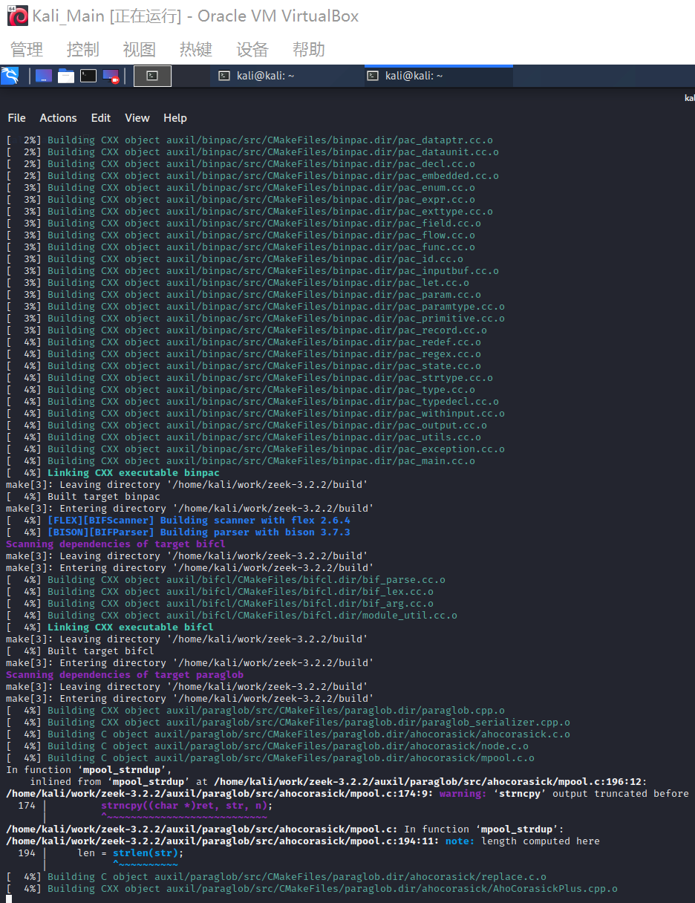

安装完成。

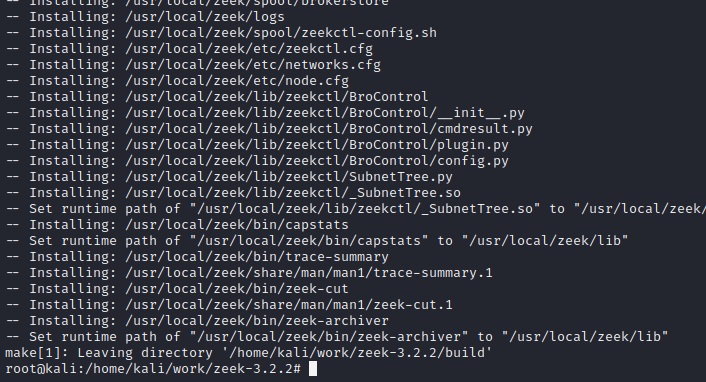

添加到环境变量。


### 编辑 zeek 配置文件

* 编辑 `/usr/local/zeek/share/zeek/site/local.zeek` ，在文件尾部追加两行新配置代码.

```bash
@load frameworks/files/extract-all-files
@load mytuning.zeek
```

* 在 `/usr/local/zeek/share/zeek/site` 目录下创建新文件 `mytuning.zeek` ，内容为

```bash
redef ignore_checksums = T;
```

### 使用 zeek 自动化分析 pcap 文件

```bash
zeek -r attack-trace.pcap /usr/local/zeek/share/zeek/site/local.zeek
```

出现警告信息 `WARNING: No Site::local_nets have been defined.  It's usually a good idea to define your local networks.` 对于本次入侵取证实验来说没有影响。

如果要解决上述警告信息，也很简单，同样是编辑 `mytuning.zeek` ，增加一行变量定义即可

```bash
redef Site::local_nets = { 192.150.11.0/24 };
```
注意添加和不添加上述一行变量定义除了 zeek 运行过程中是否会产生警告信息的差异，增加这行关于本地网络 IP 地址范围的定义对于本次实验来说会新增 2 个日志文件，会报告在当前流量（数据包文件）中发现了本地网络IP和该IP关联的已知服务信息。
在 `attack-trace.pcap` 文件的当前目录下会生成一些 `.log` 文件和一个 `extract_files` 目录，在该目录下我们会发现有一个文件。

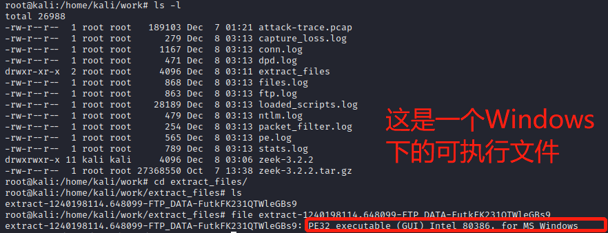

将该文件上传到 [virustotal](https://virustotal.com/) 我们会发现匹配了一个 [历史扫描报告](https://virustotal.com/en/file/b14ccb3786af7553f7c251623499a7fe67974dde69d3dffd65733871cddf6b6d/analysis/) ，该报告表明这是一个已知的后门程序！

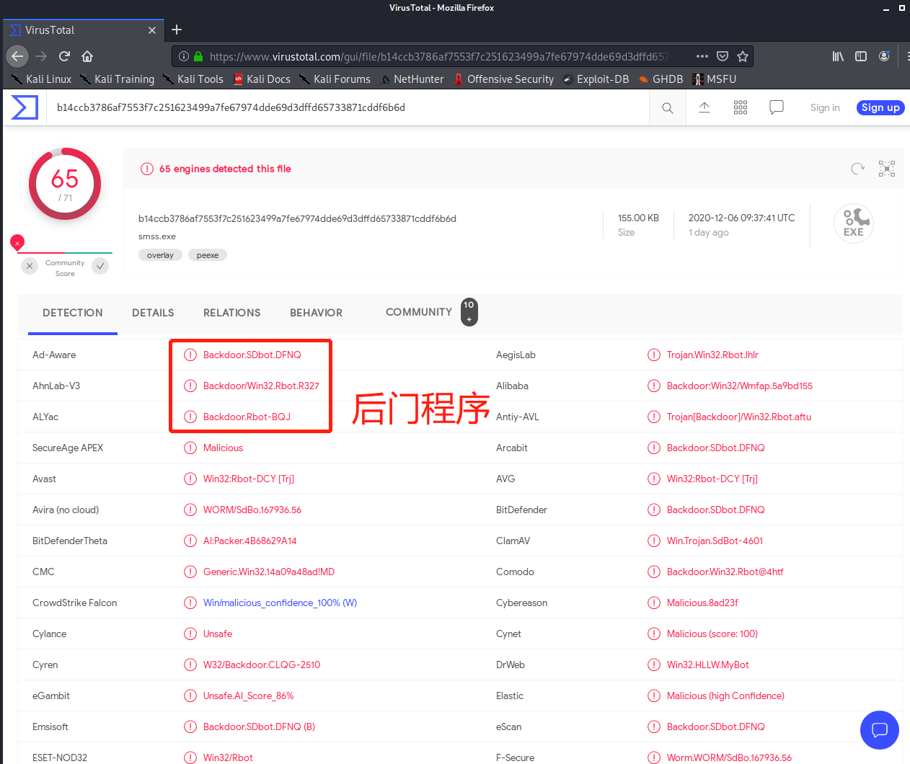

至此，基于这个发现就可以进行逆向倒推，寻找入侵线索了。
通过阅读 `/usr/local/zeek/share/zeek/base/files/extract/main.zeek` 的源代码
```zeek
function on_add(f: fa_file, args: Files::AnalyzerArgs)
{
if ( ! args?$extract_filename )
args$extract_filename = cat("extract-", f$last_active, "-", f$source,
"-", f$id);
f$info$extracted = args$extract_filename;
args$extract_filename = build_path_compressed(prefix, args$extract_filename);
f$info$extracted_cutoff = F;
mkdir(prefix);
}
```
我们了解到该文件名的最右一个-右侧对应的字符串 `FutkFK231QTWleGBs9` 是 `files.log` 中的文件唯一标识。

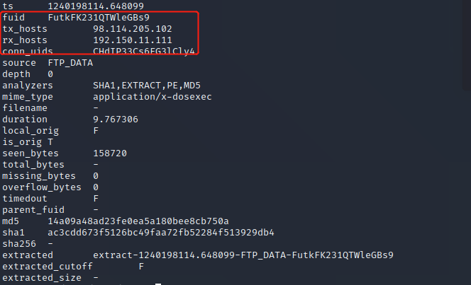

通过查看 `files.log` ，发现该文件提取自网络会话标识（ `zeek` 根据 IP 五元组计算出的一个会话唯一性散列值）为 `CHdIP33Cs6EG3lCly4` 的 FTP 会话。
该 `CHdIP33Cs6EG3lCly4` 会话标识在 `conn.log` 中可以找到对应的 IP 五元组信息。

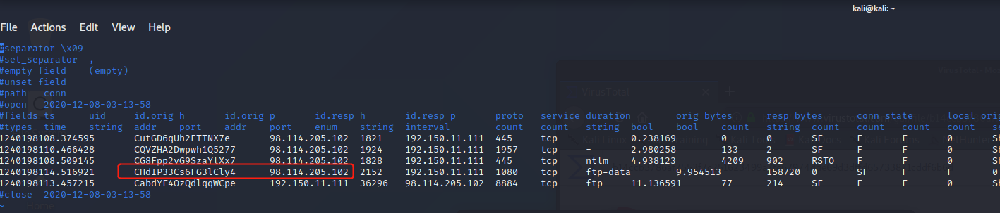

通过 `conn.log` 的会话标识匹配，我们发现该PE文件来自于IPv4地址为：`98.114.205.102` 的主机。

`ftp.log` 中默认不会显示捕获的 FTP 登录口令，我们可以通过在 `/usr/local/zeek/share/zeek/site/mytuning.zeek` 中增加以下变量重定义来实现：

```bash
redef FTP::default_capture_password = T;
```

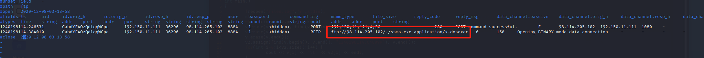

### 关于显示的问题

课本上关于《Zeek 的一些其他技巧》部分提供了一些查看文件的比较有用的命令。
### 

* 使用正确的分隔符进行过滤显示的重要性
```bash
# 从头开始查看日志文件，显示前1行
head -n1 conn.log
# Bro的日志文件默认使用的分隔符显示为ASCII码\x09，通过以下命令可以查看该ASCII码对应的“可打印字符”
echo -n -e '\x09' | hexdump -c
# 使用awk打印给定日志文件的第N列数据
awk -F '\t' '{print $3}' conn.log 
```

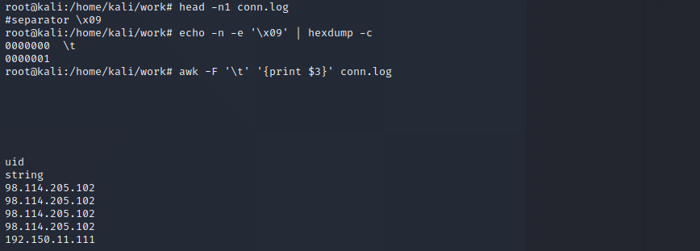

* 查看Bro的超长行日志时的横向滚动技巧
```bash
# 可以横向滚动并且一一对应，很舒服了
less -S conn.log
```
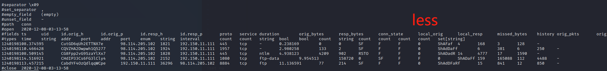

* 使用 `zeek-cut` 更“优雅”的查看日志中关注的数据列
```bash
# 查看conn.log中所有可用的“列名”
grep ^#fields conn.log | tr '\t' '\n'
# 按照“列名”输出conn.log中我们关注的一些“列”
zeek-cut ts id.orig_h id.orig_p id.resp_h id_resp_p proto < conn.log
# 将UNIX时间戳格式转换成人类可读的时间（但该方法对于大日志文件处理性能非常低）
zeek-cut -d < conn.log
```


由于我个人电脑分辨率为2560*1600，一行能看的比较长，看 `conn.log` 其实不太影响，但是对于 `file.log` 就比较难受了。

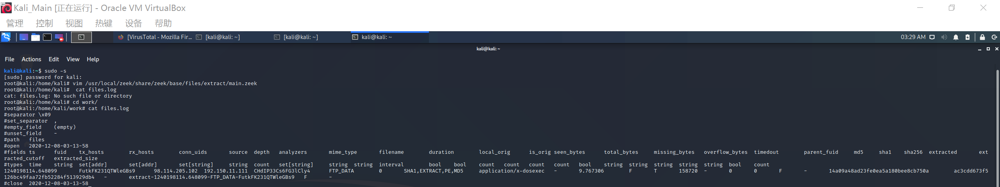

我个人更偏好于类似上次实验 `jq -s` 的显示风格，我的解决方法是编程重新排版格式。请注意我们在安装的时候，
> ```bash
> # 安装需要的包和依赖
> apt update && apt-get install cmake make gcc g++ flex bison libpcap-dev libssl-dev python-dev swig zlib1g-dev
> ```

这包含了一个完整的C++编译环境（C++用户狂喜，还支持C++20！）,那其实只要对应数据输入输出就好了。（可能用 python 按`\t` `split`更短？不是重点不做深究）

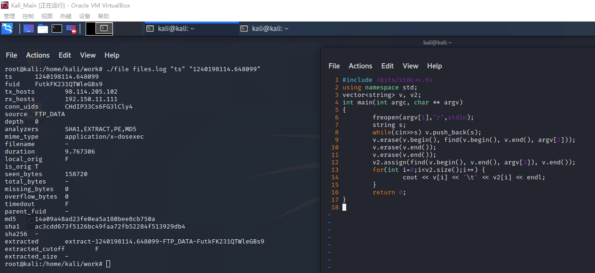


## 参考
* [Frequently Asked Questions from Official Zeek WebSite](https://www.zeek.org/documentation/faq.html)
* [Zeek 官方推荐的一些辅助工具](https://www.zeek.org/community/software.html)
